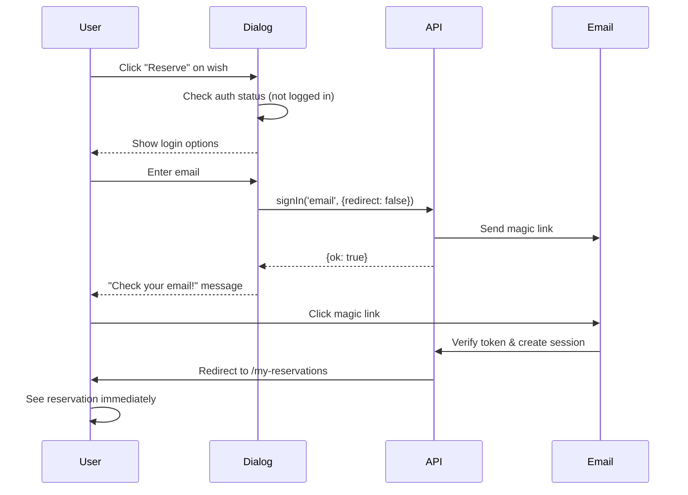
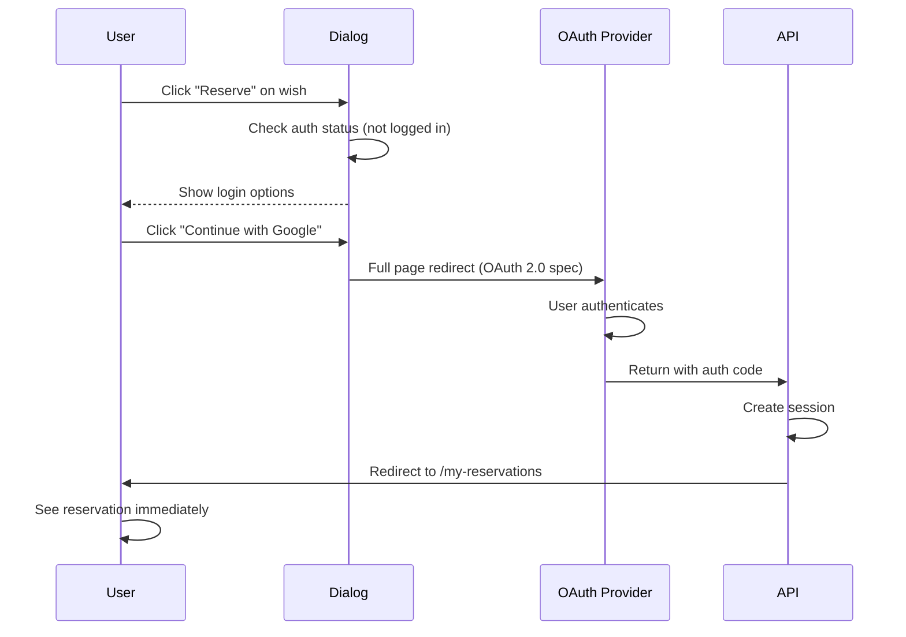
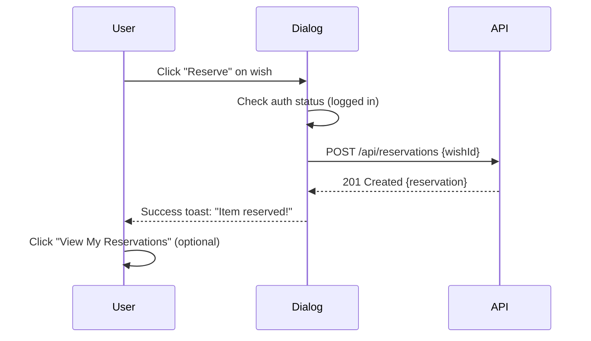

# Magic Link Reservation System - Implementation Plan

## Overview

Implement a **simple, authentication-required** reservation system where users must be logged in to reserve items. Magic link email is the primary login method (passwordless), with OAuth as an alternative. Reservations are tied directly to user accounts with no complexity.

**Key Innovation:** Uses a **hybrid dialog approach** for authentication - magic link users stay on the page (best UX), while OAuth users get the required full page redirect (OAuth 2.0 spec). This provides the optimal experience for each auth method.

---

## Table of Contents

- [Overview](#overview)
- [Key User Experience](#key-user-experience)
- [Database Schema Changes](#database-schema-changes)
- [Implementation Phases](#implementation-phases)
  - [PHASE 0: Prerequisites & Environment Setup](#phase-0-prerequisites--environment-setup-before-day-1)
  - [PHASE 1: Enable Magic Link Login](#phase-1-enable-magic-link-login-day-1)
  - [PHASE 2: Update Schema & Migrate](#phase-2-update-schema--migrate-day-1)
  - [PHASE 3: Email Confirmation Template](#phase-3-email-confirmation-template-day-1)
  - [PHASE 4: Protect Reservation Endpoint](#phase-4-protect-reservation-endpoint-day-1)
  - [PHASE 5: Create Reserve Dialog](#phase-5-create-reserve-dialog-with-hybrid-auth-day-2)
  - [PHASE 6: My Reservations Page](#phase-6-create-my-reservations-page-day-2)
  - [PHASE 7: Reservation Card Component & DELETE Endpoint](#phase-7-create-reservation-card-component--delete-endpoint-day-3)
  - [PHASE 8: Add Navigation Link](#phase-8-add-navigation-link-day-3)
  - [PHASE 9: E2E Testing](#phase-9-e2e-testing-day-4)
- [Configuration Summary](#configuration-summary)
- [Deployment Checklist](#deployment-checklist)
- [Success Metrics](#success-metrics)
- [Files Summary](#files-summary)
- [Timeline](#timeline-1-week)
- [Why This is Better](#why-this-is-better)

---

## Key User Experience

### Reservation Flow (New User - Magic Link)



### Reservation Flow (New User - OAuth)



### Reservation Flow (Logged In User)



### My Reservations Page Features

- ✅ Authenticated route (requires session)
- ✅ Shows all user's reservations
- ✅ Grouped by list owner
- ✅ One-click cancellation with undo toast
- ✅ Works instantly (no email needed)

---

## Database Schema Changes

### Clean Schema - No Backwards Compatibility

```prisma
model User {
  id            String   @id @default(cuid())
  email         String   @unique
  name          String?
  emailVerified DateTime?

  // NEW: Add this relation
  reservations  Reservation[]

  // Existing NextAuth fields
  accounts      Account[]
  sessions      Session[]
}

model Reservation {
  id             String   @id @default(cuid())
  wishId         String

  // NEW: Link to User (required, not optional)
  userId         String
  user           User     @relation(fields: [userId], references: [id], onDelete: Cascade)

  // REMOVE these fields (no longer needed):
  // reserverEmail  String?
  // reserverName   String?
  // accessToken    String?

  reservedAt     DateTime @default(now())

  @@index([userId])
  @@index([wishId])
}
```

**Key Changes:**
- Add `reservations` relation to User
- Add `userId` FK to Reservation (**required, not optional**)
- Remove `reserverEmail`, `reserverName`, `accessToken` fields
- Simpler, cleaner schema

---

## Implementation Phases

### PHASE 0: Prerequisites & Environment Setup (Before Day 1)

**Tasks:**
- [ ] Verify shadcn/ui components installed (dialog, button, input, toast, separator)
- [ ] Confirm database is set up and accessible
- [ ] Verify all required environment variables are configured
- [ ] Test SMTP configuration by sending a test email
- [ ] Ensure Prisma schema is accessible and migrations work

**Complete Environment Variables List:**

```env
# ━━━━━━━━━━━━━━━━━━━━━━━━━━━━━━━━━━━━━
# REQUIRED - Core Application
# ━━━━━━━━━━━━━━━━━━━━━━━━━━━━━━━━━━━━━

NEXTAUTH_URL=http://localhost:3000
NEXTAUTH_SECRET=<generate with: openssl rand -base64 32>
DATABASE_URL=file:./data/gthanks.db

# ━━━━━━━━━━━━━━━━━━━━━━━━━━━━━━━━━━━━━
# REQUIRED - SMTP (for magic links)
# ━━━━━━━━━━━━━━━━━━━━━━━━━━━━━━━━━━━━━

SMTP_HOST=smtp.gmail.com
SMTP_PORT=587
SMTP_USER=your-email@gmail.com
SMTP_PASS=your-app-password
EMAIL_FROM=noreply@gthanks.app

# ━━━━━━━━━━━━━━━━━━━━━━━━━━━━━━━━━━━━━
# OPTIONAL - OAuth Providers
# ━━━━━━━━━━━━━━━━━━━━━━━━━━━━━━━━━━━━━

# Google OAuth
GOOGLE_CLIENT_ID=
GOOGLE_CLIENT_SECRET=

# Facebook OAuth
FACEBOOK_CLIENT_ID=
FACEBOOK_CLIENT_SECRET=

# Apple OAuth
APPLE_ID=
APPLE_SECRET=

# Generic OIDC Provider
OIDC_CLIENT_ID=
OIDC_CLIENT_SECRET=
OIDC_ISSUER=
```

**Verification Steps:**

```bash
# 1. Check shadcn/ui components exist
ls -la src/components/ui/dialog.tsx
ls -la src/components/ui/button.tsx
ls -la src/components/ui/input.tsx
ls -la src/components/ui/toast.tsx
ls -la src/components/ui/separator.tsx

# 2. Test database connection
pnpm prisma studio

# 3. Verify environment variables
cat .env.local | grep -E "(NEXTAUTH|SMTP|DATABASE)"

# 4. Test SMTP (send test email)
# Visit http://localhost:3000/api/auth/signin
# Enter test email and verify magic link is received
```

**Expected Outcome:**
- ✅ All shadcn/ui components available
- ✅ Database accessible via Prisma Studio
- ✅ Environment variables set correctly
- ✅ SMTP working (magic link received in inbox)

---

### PHASE 1: Enable Magic Link Login (Day 1)

**Tasks:**
- [ ] Verify `src/lib/auth.ts` has EmailProvider configured
- [ ] Confirm SMTP environment variables are set (SMTP_HOST, SMTP_PORT, SMTP_USER, SMTP_PASS, EMAIL_FROM)
- [ ] Test magic link: Visit `/api/auth/signin/email`
- [ ] Enter test email and verify link is sent
- [ ] Click magic link and confirm successful login

**Already exists in codebase!** NextAuth EmailProvider should already be configured.

**Verify configuration:**

```typescript
// File: src/lib/auth.ts
import EmailProvider from 'next-auth/providers/email';

export const authOptions = {
  providers: [
    EmailProvider({
      server: {
        host: process.env.SMTP_HOST,
        port: parseInt(process.env.SMTP_PORT || '587'),
        auth: {
          user: process.env.SMTP_USER,
          pass: process.env.SMTP_PASS,
        },
      },
      from: process.env.EMAIL_FROM,
    }),
    GoogleProvider({ ... }),  // Existing
    FacebookProvider({ ... }), // Existing
  ],
};
```

**If not enabled:**
- Add EmailProvider to providers array
- Test magic link: Visit `/api/auth/signin/email`
- Enter email → Receive magic link → Click → Logged in

---

### PHASE 2: Update Schema & Migrate (Day 1)

**Tasks:**
- [ ] Update `prisma/schema.prisma` with new Reservation model
- [ ] Add `reservations` relation to User model
- [ ] Make `userId` required (NOT optional)
- [ ] Remove `reserverEmail`, `reserverName`, `accessToken` fields
- [ ] Run `pnpm prisma db push` to apply schema changes
- [ ] Verify schema changes in Prisma Studio

**Migration Strategy (DEFINITIVE):**

1. **Delete existing reservations** - Old data uses incompatible schema
2. Make `userId` **required** (not optional): `userId String`
3. Remove all old reservation fields (`reserverEmail`, `reserverName`, `accessToken`)
4. New reservations will use `userId` exclusively
5. Clean, simple schema with no backwards compatibility needed

**Schema changes:**

```prisma
// File: prisma/schema.prisma

model User {
  // ... existing fields
  reservations  Reservation[]  // NEW: Add this relation
}

model Reservation {
  id             String   @id @default(cuid())
  wishId         String

  // NEW: Required user relation
  userId         String
  user           User     @relation(fields: [userId], references: [id], onDelete: Cascade)

  reservedAt     DateTime @default(now())

  @@index([userId])
  @@index([wishId])
}
```

**Migration command:**

```bash
# Delete old reservations (if any exist)
# This will be automatic when you remove the old fields

# Update schema and push to database
pnpm prisma db push

# Verify in Prisma Studio
pnpm prisma studio
```

**Expected result:** Clean schema with required `userId`, no legacy fields.

---

### PHASE 3: Email Confirmation Template (Day 1)

**Tasks:**
- [ ] Create `src/lib/email/templates/reservation-confirmation.ts`
- [ ] Use plain text format (per user preference)
- [ ] Include product URL if available
- [ ] Link to /my-reservations (requires login)
- [ ] Test email rendering with and without product URL

**Create email template:**

```typescript
// File: src/lib/email/templates/reservation-confirmation.ts
export function getReservationConfirmationEmail(data: {
  userName: string;
  wishTitle: string;
  ownerName: string;
  productUrl?: string;
}) {
  return `
Hi ${data.userName}!

You've reserved "${data.wishTitle}" for ${data.ownerName}.

${data.productUrl ? `Buy it here: ${data.productUrl}\n\n` : ''}

━━━━━━━━━━━━━━━━━━━━━━━━━━━━━━━━━━━━━━━━━━━

View all your reservations anytime:
https://gthanks.app/my-reservations

(You'll be prompted to login if needed)

━━━━━━━━━━━━━━━━━━━━━━━━━━━━━━━━━━━━━━━━━━━

Questions? Reply to this email.

- The gthanks Team
`.trim();
}
```

**Create sendReservationConfirmation helper:**

```typescript
// File: src/lib/email/index.ts (or create if doesn't exist)
import { getReservationConfirmationEmail } from './templates/reservation-confirmation';
import nodemailer from 'nodemailer';

const transporter = nodemailer.createTransport({
  host: process.env.SMTP_HOST,
  port: parseInt(process.env.SMTP_PORT || '587'),
  auth: {
    user: process.env.SMTP_USER,
    pass: process.env.SMTP_PASS,
  },
});

export async function sendReservationConfirmation(data: {
  to: string;
  userName: string;
  wishTitle: string;
  ownerName: string;
  productUrl?: string;
}) {
  const text = getReservationConfirmationEmail({
    userName: data.userName,
    wishTitle: data.wishTitle,
    ownerName: data.ownerName,
    productUrl: data.productUrl,
  });

  await transporter.sendMail({
    from: process.env.EMAIL_FROM,
    to: data.to,
    subject: `You reserved "${data.wishTitle}"`,
    text,
  });
}
```

**Key Points:**
- ✅ Simple plain text (per user preference)
- ✅ Links to /my-reservations (requires login)
- ✅ Includes product URL if available
- ✅ No access tokens needed

---

### PHASE 4: Protect Reservation Endpoint (Day 1)

**Tasks:**
- [ ] Update POST handler to require authentication
- [ ] Add session check (return 401 if not logged in)
- [ ] Add data fetching for wish and owner details
- [ ] Use `session.user.id` for reservation creation
- [ ] Add rate limiting (10 reservations/hour per user per list)
- [ ] Send confirmation email after successful reservation
- [ ] Test endpoint with and without authentication

**Update POST handler to require authentication:**

```typescript
// File: src/app/api/reservations/route.ts
import { getServerSession } from 'next-auth';
import { NextRequest, NextResponse } from 'next/server';
import { db } from '@/lib/db';
import { rateLimiter } from '@/lib/rate-limiter';
import { sendReservationConfirmation } from '@/lib/email';

// Helper function to get list ID from wish
async function getListIdFromWish(wishId: string): Promise<string | null> {
  const listWish = await db.listWish.findFirst({
    where: { wishId },
    select: { listId: true }
  });
  return listWish?.listId || null;
}

export async function POST(request: NextRequest) {
  // REQUIRE AUTHENTICATION
  const session = await getServerSession();

  if (!session?.user) {
    return NextResponse.json(
      { error: 'You must be logged in to reserve items' },
      { status: 401 }
    );
  }

  const { wishId } = await request.json();

  // Fetch wish with owner details
  const wish = await db.wish.findUnique({
    where: { id: wishId },
    include: {
      owner: {
        select: { name: true, email: true }
      }
    }
  });

  if (!wish) {
    return NextResponse.json(
      { error: 'Wish not found' },
      { status: 404 }
    );
  }

  // Apply rate limiting (per list, per user)
  const listId = await getListIdFromWish(wishId);
  const rateLimitKey = `reservation:${session.user.id}:${listId}`;
  const rateLimitResult = await rateLimiter.check(rateLimitKey, 10, 3600); // 10/hour per list

  if (!rateLimitResult.allowed) {
    return NextResponse.json(
      { error: 'Too many reservations. Please wait.', retryAfter: rateLimitResult.retryAfter },
      { status: 429 }
    );
  }

  // Create reservation (linked to user)
  const reservation = await db.reservation.create({
    data: {
      wishId,
      userId: session.user.id,  // Direct user link
      reservedAt: new Date(),
    }
  });

  // Send confirmation email
  await sendReservationConfirmation({
    to: session.user.email,
    userName: session.user.name || 'there',
    wishTitle: wish.title,
    ownerName: wish.owner.name || wish.owner.email,
    productUrl: wish.url,
  });

  return NextResponse.json(reservation, { status: 201 });
}
```

**Key Changes:**
- ✅ Check session first (authentication required)
- ✅ Return 401 if not logged in
- ✅ Fetch wish with owner details for email
- ✅ Helper function to get list ID from wish
- ✅ Use `session.user.id` for reservation
- ✅ No more email/name in request body
- ✅ Simpler, more secure

---

### PHASE 5: Create Reserve Dialog with Hybrid Auth (Day 2)

**Tasks:**
- [ ] Create `src/components/reservations/reserve-dialog.tsx`
- [ ] Implement magic link flow with `redirect: false`
- [ ] Implement OAuth flow with full page redirect
- [ ] Add "Check your email" success state for magic link
- [ ] Fix React infinite loop with proper useEffect dependencies
- [ ] Handle logged-in users (instant reservation)
- [ ] Test both magic link and OAuth flows
- [ ] Integrate dialog into wish card component

**Create dialog component:**

```typescript
// File: src/components/reservations/reserve-dialog.tsx
'use client';

import { useState, useEffect } from 'react';
import { signIn, useSession } from 'next-auth/react';
import { useRouter } from 'next/navigation';
import { Dialog, DialogContent, DialogHeader, DialogTitle, DialogDescription } from '@/components/ui/dialog';
import { Button } from '@/components/ui/button';
import { Input } from '@/components/ui/input';
import { Separator } from '@/components/ui/separator';
import { useToast } from '@/components/ui/use-toast';

interface ReserveDialogProps {
  wish: { id: string; title: string };
  open: boolean;
  onOpenChange: (open: boolean) => void;
}

export function ReserveDialog({ wish, open, onOpenChange }: ReserveDialogProps) {
  const { data: session } = useSession();
  const [email, setEmail] = useState('');
  const [emailSent, setEmailSent] = useState(false);
  const [isLoading, setIsLoading] = useState(false);
  const { toast } = useToast();
  const router = useRouter();

  // Determine available OAuth providers from environment
  const availableProviders = {
    google: !!process.env.NEXT_PUBLIC_GOOGLE_CLIENT_ID,
    facebook: !!process.env.NEXT_PUBLIC_FACEBOOK_CLIENT_ID,
    apple: !!process.env.NEXT_PUBLIC_APPLE_CLIENT_ID,
  };

  const hasOAuthProviders = Object.values(availableProviders).some(Boolean);

  // If already logged in, reserve immediately
  // FIX: Only trigger when session.user.id or open changes (prevents infinite loop)
  useEffect(() => {
    if (session?.user && open) {
      handleReserveNow();
      onOpenChange(false);
    }
  }, [session?.user?.id, open]); // Only trigger when these values change

  const handleReserveNow = async () => {
    try {
      await fetch('/api/reservations', {
        method: 'POST',
        headers: { 'Content-Type': 'application/json' },
        body: JSON.stringify({ wishId: wish.id }),
      });

      onOpenChange(false);

      toast({
        title: 'Item reserved!',
        description: 'Check "My Reservations" to see all your items.',
        action: <Button onClick={() => router.push('/my-reservations')}>View</Button>
      });
    } catch (error) {
      toast({
        title: 'Failed to reserve',
        description: 'Please try again.',
        variant: 'destructive'
      });
    }
  };

  const handleMagicLink = async (e: React.FormEvent) => {
    e.preventDefault();
    setIsLoading(true);

    const callbackUrl = `/my-reservations?reserved=${wish.id}`;

    // CRITICAL: Use redirect: false to keep user on page
    const result = await signIn('email', {
      email,
      callbackUrl,
      redirect: false // Keeps user on page, shows success message
    });

    setIsLoading(false);

    if (result?.ok) {
      setEmailSent(true); // Show "Check your email" message
    } else {
      toast({
        title: 'Failed to send magic link',
        description: 'Please try again.',
        variant: 'destructive'
      });
    }
  };

  const handleOAuth = (provider: string) => {
    const callbackUrl = `/my-reservations?reserved=${wish.id}`;
    // OAuth MUST do full page redirect (OAuth 2.0 spec requirement)
    signIn(provider, { callbackUrl });
  };

  return (
    <Dialog open={open} onOpenChange={onOpenChange}>
      <DialogContent>
        <DialogHeader>
          <DialogTitle>Sign in to reserve</DialogTitle>
          <DialogDescription>
            Sign in to reserve "{wish.title}"
          </DialogDescription>
        </DialogHeader>

        {emailSent ? (
          <div className="text-center py-6 space-y-2">
            <p className="font-medium">Check your email!</p>
            <p className="text-sm text-muted-foreground">
              We sent a login link to {email}
            </p>
            <p className="text-sm text-muted-foreground">
              After signing in, you'll see this reservation in "My Reservations"
            </p>
          </div>
        ) : (
          <div className="space-y-4">
            {/* OAuth Buttons (if configured) */}
            {hasOAuthProviders && (
              <div className="space-y-2">
                {availableProviders.google && (
                  <Button
                    variant="outline"
                    className="w-full"
                    onClick={() => handleOAuth('google')}
                  >
                    Continue with Google
                  </Button>
                )}

                {availableProviders.facebook && (
                  <Button
                    variant="outline"
                    className="w-full"
                    onClick={() => handleOAuth('facebook')}
                  >
                    Continue with Facebook
                  </Button>
                )}

                {availableProviders.apple && (
                  <Button
                    variant="outline"
                    className="w-full"
                    onClick={() => handleOAuth('apple')}
                  >
                    Continue with Apple
                  </Button>
                )}
              </div>
            )}

            {hasOAuthProviders && (
              <div className="relative">
                <div className="absolute inset-0 flex items-center">
                  <Separator />
                </div>
                <div className="relative flex justify-center text-xs uppercase">
                  <span className="bg-background px-2 text-muted-foreground">
                    Or continue with email
                  </span>
                </div>
              </div>
            )}

            {/* Magic Link Form */}
            <form onSubmit={handleMagicLink} className="space-y-3">
              <Input
                type="email"
                placeholder="you@example.com"
                value={email}
                onChange={(e) => setEmail(e.target.value)}
                required
                disabled={isLoading}
              />
              <Button type="submit" className="w-full" disabled={isLoading}>
                {isLoading ? 'Sending...' : 'Send Login Link'}
              </Button>
            </form>
          </div>
        )}
      </DialogContent>
    </Dialog>
  );
}
```

**Integrate into wish card:**

```typescript
// File: src/components/wishes/wish-card.tsx (or wherever reserve button is)
'use client';

import { useState } from 'react';
import { useSession } from 'next-auth/react';
import { ReserveDialog } from '@/components/reservations/reserve-dialog';

export function WishCard({ wish }: Props) {
  const { data: session } = useSession();
  const [dialogOpen, setDialogOpen] = useState(false);

  const handleReserve = () => {
    setDialogOpen(true); // Always show dialog - it handles auth check
  };

  return (
    <Card>
      {/* ... wish content ... */}
      <Button onClick={handleReserve}>Reserve</Button>

      <ReserveDialog
        wish={wish}
        open={dialogOpen}
        onOpenChange={setDialogOpen}
      />
    </Card>
  );
}
```

**Hybrid Dialog Flow:**

**For Magic Link Users (Best UX):**
1. Dialog opens, user enters email
2. Calls `signIn('email', { redirect: false })` - stays on page
3. Shows "Check your email" message in dialog
4. User clicks link in email → redirects to /my-reservations
5. Sees reservation immediately

**For OAuth Users (Required Redirect):**
1. Dialog opens, user clicks "Continue with Google"
2. Calls `signIn('google', { callbackUrl })` - full page redirect (OAuth spec requirement)
3. Google auth flow (leaves your domain)
4. After auth → redirects to /my-reservations
5. Sees reservation immediately

**For Logged In Users:**
1. Dialog detects session via useEffect
2. Reserves immediately without showing dialog
3. Shows success toast

---

### PHASE 6: Create My Reservations Page (Day 2)

**Tasks:**
- [ ] Create `src/app/my-reservations/page.tsx`
- [ ] Add authentication check (redirect if not logged in)
- [ ] Fetch user's reservations with wish details
- [ ] Group reservations by list owner
- [ ] Display empty state if no reservations
- [ ] Fix server component button issue with Client Component
- [ ] Test with multiple reservations from different lists

**Create reservations page:**

```typescript
// File: src/app/my-reservations/page.tsx
import { getServerSession } from 'next-auth';
import { redirect } from 'next/navigation';
import { db } from '@/lib/db';
import { ReservationCard } from '@/components/reservations/reservation-card';
import { Alert, AlertDescription } from '@/components/ui/alert';
import { BrowseListsButton } from '@/components/my-reservations/BrowseListsButton';

export default async function MyReservationsPage() {
  const session = await getServerSession();

  if (!session?.user) {
    redirect('/api/auth/signin?callbackUrl=/my-reservations');
  }

  // Fetch user's reservations
  const reservations = await db.reservation.findMany({
    where: { userId: session.user.id },
    include: {
      wish: {
        include: {
          owner: {
            select: { name: true, email: true }
          }
        }
      }
    },
    orderBy: { reservedAt: 'desc' }
  });

  // Group by list owner
  const groupedByOwner = reservations.reduce((acc, res) => {
    const ownerName = res.wish.owner.name || res.wish.owner.email;
    if (!acc[ownerName]) acc[ownerName] = [];
    acc[ownerName].push(res);
    return acc;
  }, {} as Record<string, typeof reservations>);

  return (
    <div className="container max-w-4xl py-8">
      <h1 className="text-3xl font-bold mb-6">My Reservations</h1>

      {reservations.length === 0 ? (
        <div className="text-center py-12">
          <p className="text-muted-foreground">You haven't reserved any items yet.</p>
          <BrowseListsButton />
        </div>
      ) : (
        <>
          {Object.entries(groupedByOwner).map(([ownerName, items]) => (
            <div key={ownerName} className="mb-8">
              <h2 className="text-xl font-semibold mb-4">
                For {ownerName} ({items.length} {items.length === 1 ? 'item' : 'items'})
              </h2>

              <div className="space-y-3">
                {items.map((reservation) => (
                  <ReservationCard
                    key={reservation.id}
                    reservation={reservation}
                  />
                ))}
              </div>
            </div>
          ))}

          {reservations.length > 5 && (
            <Alert className="mt-6">
              <AlertDescription>
                You've reserved {reservations.length} items! That's a lot of gifts!
              </AlertDescription>
            </Alert>
          )}
        </>
      )}
    </div>
  );
}
```

**Create BrowseListsButton Client Component:**

```typescript
// File: src/components/my-reservations/BrowseListsButton.tsx
'use client';

import { useRouter } from 'next/navigation';
import { Button } from '@/components/ui/button';

export function BrowseListsButton() {
  const router = useRouter();

  return (
    <Button onClick={() => router.push('/lists')} className="mt-4">
      Browse Lists
    </Button>
  );
}
```

**Note:** The BrowseListsButton component is a Client Component because it uses `useRouter` for navigation. This fixes the server component issue where buttons with onClick handlers cannot be used directly in Server Components.

---

### PHASE 7: Create Reservation Card Component & DELETE Endpoint (Day 3)

**Tasks:**
- [ ] Create `src/components/reservations/reservation-card.tsx`
- [ ] Display wish title and reservation date
- [ ] Add product link (if available)
- [ ] Implement cancel mutation with router.refresh()
- [ ] Add undo functionality (5-second window)
- [ ] Create DELETE endpoint at `/api/reservations/[id]/route.ts`
- [ ] Test cancellation and undo flow

**Create reservation card:**

```typescript
// File: src/components/reservations/reservation-card.tsx
'use client';

import { useMutation } from '@tanstack/react-query';
import { useState } from 'react';
import { useRouter } from 'next/navigation';
import { formatDistanceToNow } from 'date-fns';
import { Card, CardContent, CardFooter } from '@/components/ui/card';
import { Button } from '@/components/ui/button';
import { useToast } from '@/components/ui/use-toast';

interface ReservationCardProps {
  reservation: {
    id: string;
    reservedAt: Date;
    wish: {
      title: string;
      url?: string;
    };
  };
}

export function ReservationCard({ reservation }: ReservationCardProps) {
  const [undoToken, setUndoToken] = useState<string | null>(null);
  const { toast } = useToast();
  const router = useRouter();

  const cancelMutation = useMutation({
    mutationFn: async (id: string) => {
      const response = await fetch(`/api/reservations/${id}`, {
        method: 'DELETE',
      });
      if (!response.ok) throw new Error('Failed to cancel');
      return { id };
    },
    onSuccess: ({ id }) => {
      // Store for undo
      setUndoToken(id);
      setTimeout(() => setUndoToken(null), 5000);

      // FIX: Use router.refresh() instead of queryClient
      router.refresh(); // Re-fetch server component data

      toast({
        title: 'Reservation cancelled',
        description: 'The item is now available for others.',
        action: undoToken && (
          <Button variant="outline" size="sm" onClick={handleUndo}>
            Undo
          </Button>
        )
      });
    }
  });

  const handleUndo = async () => {
    // Re-create reservation
    // Implementation depends on undo strategy
  };

  return (
    <Card>
      <CardContent className="pt-6">
        <div className="flex items-start justify-between">
          <div>
            <h3 className="font-semibold text-lg">{reservation.wish.title}</h3>
            <p className="text-sm text-muted-foreground">
              Reserved {formatDistanceToNow(reservation.reservedAt, { addSuffix: true })}
            </p>
            {reservation.wish.url && (
              <a
                href={reservation.wish.url}
                target="_blank"
                rel="noopener noreferrer"
                className="text-sm text-primary hover:underline mt-2 inline-block"
              >
                View product →
              </a>
            )}
          </div>
        </div>
      </CardContent>

      <CardFooter>
        <Button
          variant="destructive"
          size="sm"
          onClick={() => cancelMutation.mutate(reservation.id)}
          disabled={cancelMutation.isPending}
        >
          {cancelMutation.isPending ? 'Cancelling...' : 'Cancel Reservation'}
        </Button>
      </CardFooter>
    </Card>
  );
}
```

**Create DELETE endpoint:**

```typescript
// File: src/app/api/reservations/[id]/route.ts
import { getServerSession } from 'next-auth';
import { NextRequest, NextResponse } from 'next/server';
import { db } from '@/lib/db';

export async function DELETE(
  request: NextRequest,
  { params }: { params: { id: string } }
) {
  const session = await getServerSession();

  if (!session?.user) {
    return NextResponse.json(
      { error: 'Unauthorized' },
      { status: 401 }
    );
  }

  // Verify user owns this reservation
  const reservation = await db.reservation.findUnique({
    where: { id: params.id },
  });

  if (!reservation) {
    return NextResponse.json(
      { error: 'Reservation not found' },
      { status: 404 }
    );
  }

  if (reservation.userId !== session.user.id) {
    return NextResponse.json(
      { error: 'Forbidden' },
      { status: 403 }
    );
  }

  await db.reservation.delete({
    where: { id: params.id },
  });

  return new NextResponse(null, { status: 204 });
}
```

**Key Points:**
- ✅ Uses `router.refresh()` instead of React Query invalidation (works with Server Components)
- ✅ DELETE endpoint verifies ownership before deletion
- ✅ Proper HTTP status codes (204 for successful deletion)
- ✅ Authorization checks prevent unauthorized deletions

---

### PHASE 8: Add Navigation Link (Day 3)

**Tasks:**
- [ ] Add "My Reservations" link to main navigation
- [ ] Position link logically (after "My Lists", before "Groups")
- [ ] Test navigation on mobile and desktop
- [ ] Optional: Add badge showing reservation count

**Add navigation link:**

```typescript
// File: src/components/common/Nav.tsx (or wherever main nav lives)
<nav>
  <Link href="/wishes">My Wishes</Link>
  <Link href="/lists">My Lists</Link>
  <Link href="/my-reservations">My Reservations</Link> {/* NEW */}
  <Link href="/groups">Groups</Link>
</nav>
```

**Optional: Show badge with count:**

```typescript
// File: src/components/common/Nav.tsx
const { data: reservationCount } = useQuery({
  queryKey: ['reservation-count'],
  queryFn: async () => {
    const res = await fetch('/api/reservations/count');
    return res.json();
  },
  enabled: !!session
});

<Link href="/my-reservations">
  My Reservations
  {reservationCount > 0 && (
    <Badge variant="secondary">{reservationCount}</Badge>
  )}
</Link>
```

---

### PHASE 9: E2E Testing (Day 4)

**Tasks:**
- [ ] Create `tests/e2e/reservations/magic-link-flow.spec.ts`
- [ ] Test: New user → magic link → reservation visible
- [ ] Test: Logged in user → instant reservation
- [ ] Test: Cancel reservation with undo
- [ ] Create `tests/e2e/reservations/oauth-flow.spec.ts`
- [ ] Test: OAuth login → reservation visible
- [ ] All tests passing

**Create E2E tests:**

```typescript
// File: tests/e2e/reservations/magic-link-flow.spec.ts
import { test, expect } from '@playwright/test';

test.describe('Magic Link Reservation Flow', () => {
  test('new user: reserve → magic link → dashboard', async ({ page }) => {
    // 1. Visit public list (not logged in)
    await page.goto('/lists/public-list-123');

    // 2. Click reserve
    await page.click('[data-testid="reserve-red-bike"]');

    // 3. Should show dialog (not redirect)
    await expect(page.locator('[role="dialog"]')).toBeVisible();
    await expect(page.locator('text=Sign in to reserve')).toBeVisible();

    // 4. Enter email for magic link
    await page.fill('[type="email"]', 'test@example.com');
    await page.click('button:has-text("Send Login Link")');

    // 5. Should show "Check your email" message
    await expect(page.locator('text=Check your email!')).toBeVisible();
    await expect(page.locator('text=We sent a login link to test@example.com')).toBeVisible();

    // 6. Simulate magic link click
    const magicLink = await getMagicLink('test@example.com');
    await page.goto(magicLink);

    // 7. Should be logged in and redirected to /my-reservations
    await expect(page).toHaveURL('/my-reservations');

    // 8. Should see the reserved item
    await expect(page.locator('text=Red Bike')).toBeVisible();
  });

  test('logged in user: instant reservation', async ({ page }) => {
    // Login first
    await loginWithMagicLink(page, 'user@example.com');

    // Visit list
    await page.goto('/lists/public-list-123');

    // Click reserve
    await page.click('[data-testid="reserve-red-bike"]');

    // Should see success toast immediately (no redirect)
    await expect(page.locator('text=Item reserved!')).toBeVisible();

    // Navigate to My Reservations
    await page.click('text=My Reservations');

    // Should see the item
    await expect(page.locator('text=Red Bike')).toBeVisible();
  });

  test('cancel reservation with undo', async ({ page }) => {
    await loginWithMagicLink(page, 'user@example.com');
    await seedReservation('user@example.com', 'Red Bike');

    await page.goto('/my-reservations');

    // Cancel
    await page.click('[data-testid="cancel-red-bike"]');
    await expect(page.locator('text=Reservation cancelled')).toBeVisible();

    // Undo button should appear for 5 seconds
    await expect(page.locator('button:has-text("Undo")')).toBeVisible();

    // Click undo
    await page.click('button:has-text("Undo")');

    // Reservation should be back
    await expect(page.locator('text=Red Bike')).toBeVisible();
  });
});
```

---

## Configuration Summary

### UX Flow

**New Users:**
1. Click "Reserve" → Dialog opens
2. Enter email → Receive magic link
3. Click magic link → Logged in
4. Redirected to /my-reservations
5. See their reservation

**Returning Users:**
1. Click "Reserve" → Instant (already logged in)
2. Success toast
3. Can visit /my-reservations anytime

### Key Design Decisions

- **Authentication Required:** No anonymous reservations
- **Hybrid Dialog Login:** Dialog for magic link (stays on page), full redirect for OAuth (required)
- **Magic Link Primary:** Email-based passwordless login (OAuth also available)
- **OAuth Support:** Full page redirect to Google/Facebook/Apple (OAuth 2.0 spec requirement)
- **Callback URL:** All auth methods redirect to /my-reservations after login
- **Grouped Display:** Reservations grouped by list owner
- **Instant Cancellation:** One-click cancel with 5-second undo
- **Rate Limiting:** 10 reservations/hour per user per list
- **Email Confirmation:** Simple plain text with product link

---

## Deployment Checklist

**Pre-deployment:**
- [ ] Environment variables configured (see Phase 0)
- [ ] NextAuth EmailProvider verified and working
- [ ] SMTP credentials tested (send test magic link)
- [ ] Prisma schema updated (reservations relation)
- [ ] Old reservations deleted (clean migration)
- [ ] Migration run: `pnpm prisma db push`
- [ ] /my-reservations page requires authentication
- [ ] Reserve button opens dialog correctly
- [ ] Rate limiting applied (10/hour per user per list)
- [ ] E2E tests passing
- [ ] Mobile UI tested at 375px viewport
- [ ] Email template renders correctly

**Post-deployment monitoring:**
- Monitor magic link delivery rate
- Track reservation completion rate
- Watch for failed login attempts
- Monitor rate limit violations

---

## Success Metrics

1. **Reservation completion rate:** >90% (after login)
2. **Magic link delivery:** >95% (no bounces)
3. **Login success rate:** >95% (magic link clicks work)
4. **Cancellation rate:** <10% (indicates good UX)
5. **Time to first reservation:** <2 minutes (including login)

---

## Files Summary

### New Files to Create

```
src/app/my-reservations/page.tsx
src/components/my-reservations/BrowseListsButton.tsx (Client Component for navigation)
src/components/reservations/reserve-dialog.tsx (Hybrid auth dialog)
src/components/reservations/reservation-card.tsx
src/lib/email/templates/reservation-confirmation.ts
src/lib/email/index.ts (if doesn't exist - for sendReservationConfirmation)
src/app/api/reservations/[id]/route.ts (DELETE endpoint)
tests/e2e/reservations/magic-link-flow.spec.ts
tests/e2e/reservations/oauth-flow.spec.ts
```

### Files to Modify

```
prisma/schema.prisma (add reservations relation, make userId required)
src/app/api/reservations/route.ts (require authentication, add data fetching)
src/components/wishes/wish-card.tsx (integrate reserve dialog)
src/components/common/Nav.tsx (add My Reservations link)
```

### Files NOT Needed (Removed from old plan)

```
❌ src/lib/services/email-verification.ts
❌ src/app/api/reservations/verify/route.ts
❌ src/app/api/cron/cleanup-shadow-accounts/route.ts
❌ src/components/reservations/reservation-list-group.tsx
❌ Shadow account logic
❌ Verification code system
❌ Account cleanup cron
```

---

## Timeline: 1 Week

- **Day 0:** Prerequisites & environment setup
- **Day 1:** Schema updates, email template, auth requirement
- **Day 2:** Reserve dialog + My Reservations page
- **Day 3:** Reservation card, navigation, DELETE endpoint
- **Day 4:** E2E testing
- **Day 5:** Polish + deployment

**Simplified from 3 weeks to 1 week!**

---

## Why This is Better

### Complexity Reduction
- No shadow accounts
- No verification codes
- No account cleanup cron
- No dual access patterns
- Standard NextAuth flow

### Better UX
- Instant access to reservations (no email wait)
- Works offline after login
- Familiar login pattern
- Less email spam
- OAuth option available
- **Hybrid Dialog:** Keeps users in context (no jarring full page redirects for magic link)
- **Smart Auth Detection:** Dialog automatically reserves if already logged in

### Hybrid Dialog Benefits
- **Magic Link:** Stays on page, shows "Check your email" message (best UX)
- **OAuth:** Full page redirect only when necessary (OAuth 2.0 spec requirement)
- **Consistent Pattern:** Users expect "Continue with Google" to open OAuth flow
- **Industry Standard:** Same pattern used by Medium, Notion, Linear, etc.
- **Mobile-Friendly:** Dialog works seamlessly on mobile (375px+)

### OAuth 2.0 Technical Constraint
- OAuth providers (Google, Facebook, Apple) REQUIRE full page redirects
- This is a security feature of OAuth 2.0 spec (prevents iframe attacks)
- Unavoidable - trying to use modal/iframe violates X-Frame-Options
- Hybrid approach respects this while optimizing magic link flow

### Security
- Proper authentication required
- No tokens in URLs
- Session-based access
- Standard NextAuth security
- OAuth redirect validates origin

### Maintenance
- Simpler codebase
- Fewer edge cases
- Standard patterns
- Less to break
- Single dialog component handles all auth methods

---

**Plan Status:** Ready for implementation (with hybrid dialog auth)
**Last Updated:** 2025-11-21 (Fixed critical issues per expert consensus)
**Approved By:** User
